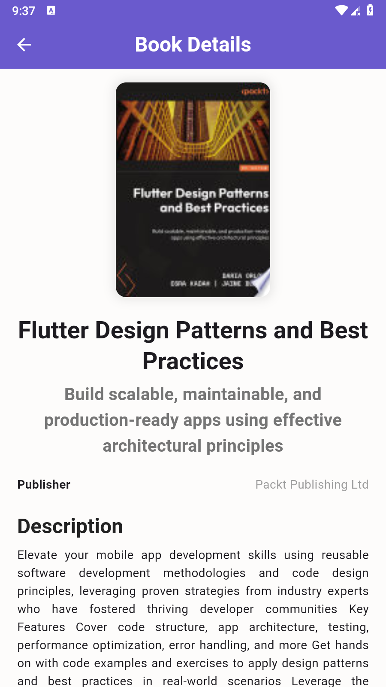

#  BookFinder  

**BookFinder** is a Flutter application that helps users search for books, view details, and manage their favorite books.  

## Features  

 **Search Books** – Find books by title or author  
 **Book Details** – View book information (title, author, publisher, cover image)  
 **Favorites** – Save and manage favorite books  
 **Theming** – Supports light & dark mode  

## APP SCREENSHOT 
### Home Screen  
  

### Book Details  
  

### Favorites  
  

### Settings  
  


##  Installation  

```sh
git clone https://github.com/usamasultan2018/bookfinder.git
cd bookfinder
flutter pub get
flutter run

